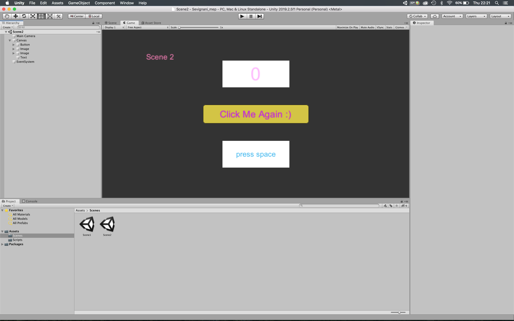
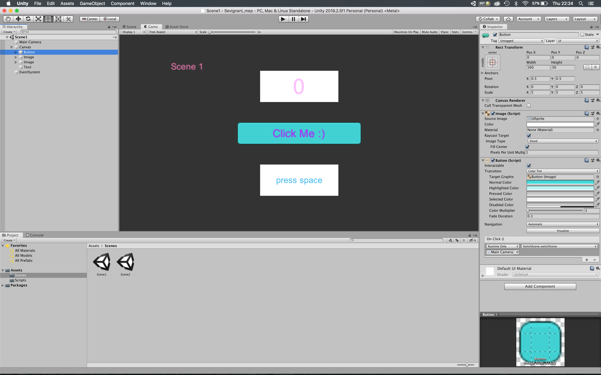
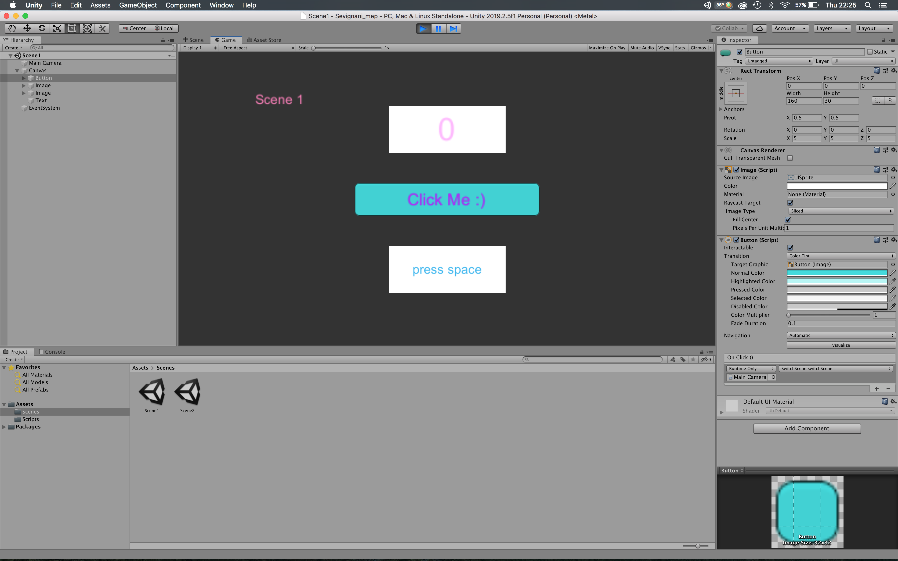
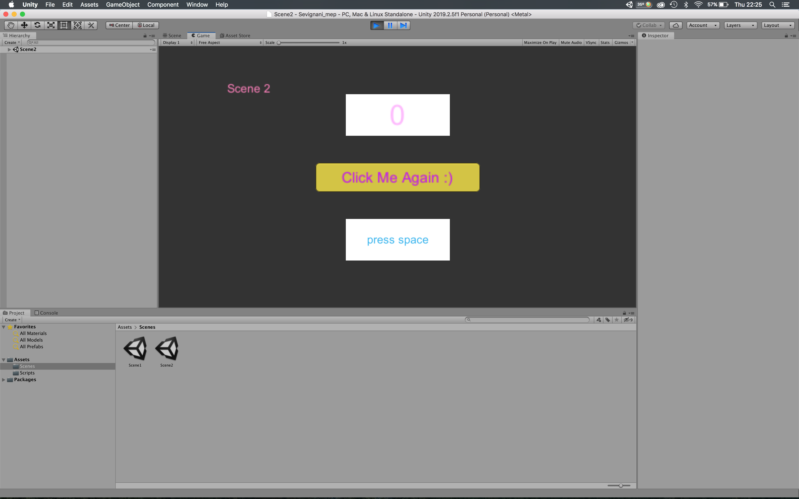

erstes Projekt 5AHMNM Elena Sevignani
Description: Projekt enthält zwei scenes, Button click löst scene change aus
Space Bar -> Image ändert seine Farbe
Hover auf Image -> Zahl zeigt an wie oft die Mouse geentert ist

Developement Platform 

MacBook Pro (Retina, 15-inch, Mid 2015) OS X El Capitan 10.11.6, Unity Version 2019.2.5f1

Alle Scripts von Julian Propst

Für die Scripts musste ich Brackets verwenden, da meine OSX Version zu alt ist für Visual Studio

Target Platform: webGL 
Referenz Auflösung: 1280px x 720px

Erstelle ein Unity Projekt welches mit git via ssh Authentifizierung auf GitHub versioniert ist: DONE

2 Szenen enthalten: DONE

einen Butten wenn dieser betätigt wird sollte ein Szenenwechsel passieren: DONE

einen Tastendruck (Leertaste): sobald die Leertaste gedrückt wird sollte sich auf einem Canvas zufällig die Farbe ändern: DONE

ein weiteres Canvas mit einem Textelement welches anzeigt wie oft man mit der Maus über das Canvas hovered: DONE

Screenshots:

